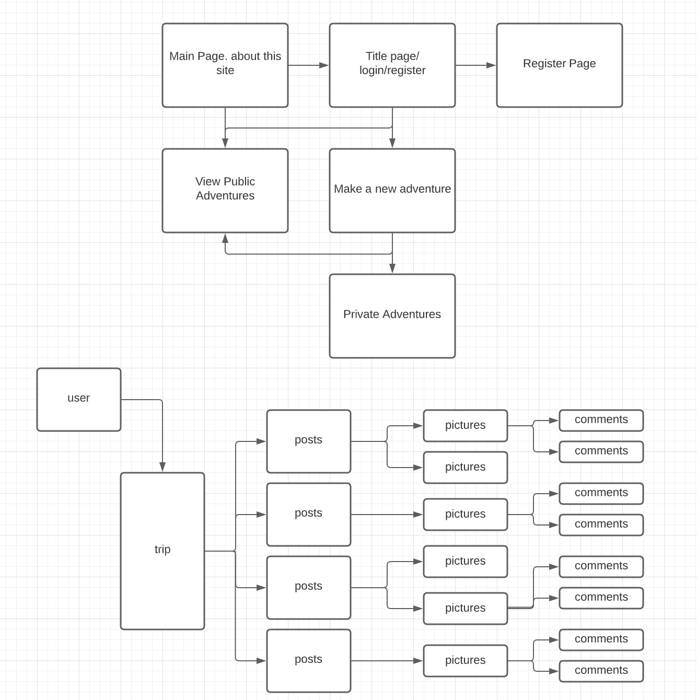
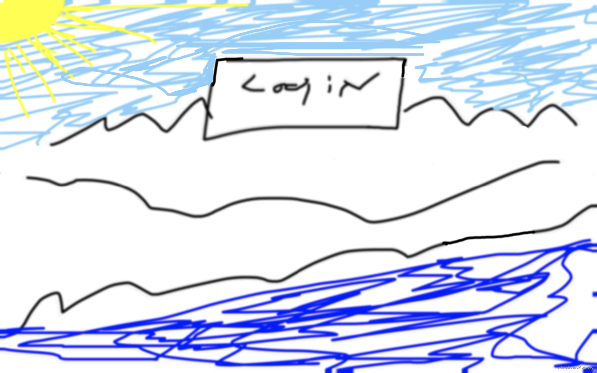
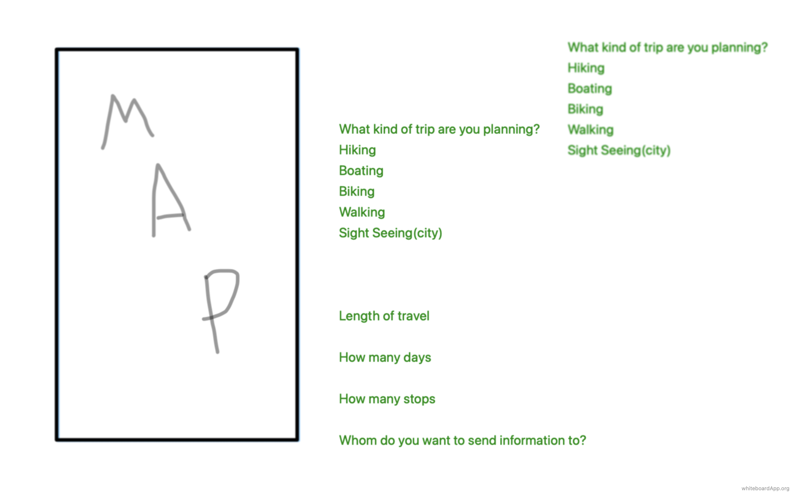

# Trips_and_Adventures
****

## Why am I building this?
---
This Project started out to be a Kayaking adventure log. I wanted to be able to create a trip with stops along the way. After the trip was created, I would send that information to a loved one, so in the event of an emergency, they would know about where I should be. Along the route I would post pictures. Anyone logged in to the app would have the ability to post comments or likes to those photos. When I reach a "marker" an email would be sent to my contact person allowing them a little piece of mind.

I am building this app with a Python3 / flask Back-end. I choose this because a many to many relational database has been easier for me with this setup.

For the front-end I'm using React. I am told that this is a good program for this and I am still learning how to use it.

 

 

 

 
